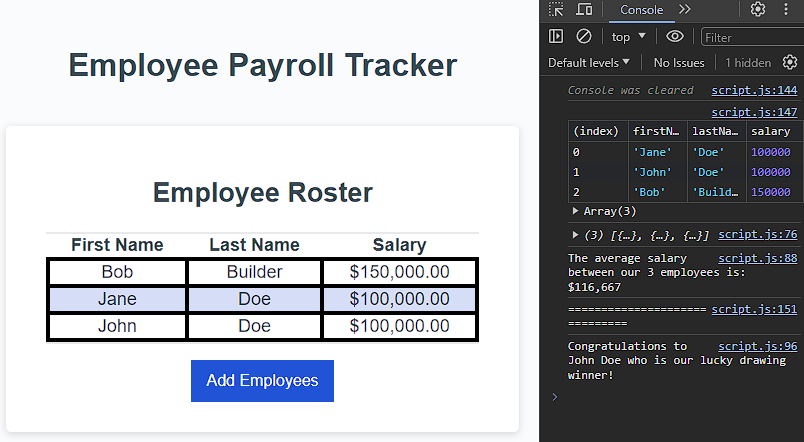

# Employee Payroll Tracker

## Description

This tracker will allow you to alphabetically list your employees as well as track their annual sallaries. This simple tracker will not save information between sessions, but is a good tool for short-term tracking.

## Installation

No instillation is required for this project. To access the website click on this link: https://aranosbanazir.github.io/employee-payroll-tracker

## Usage
To use the website, first open the developer console by right clicking on the page, and hitting inspect. You can enter employee information into the prompts that follow hitting the button to add employees. Names, both first and last, only accept letter characters. Salary input will only accept numbers, if no information is added or the input is not considered to be numeric, it will track the salary as $0.00.

